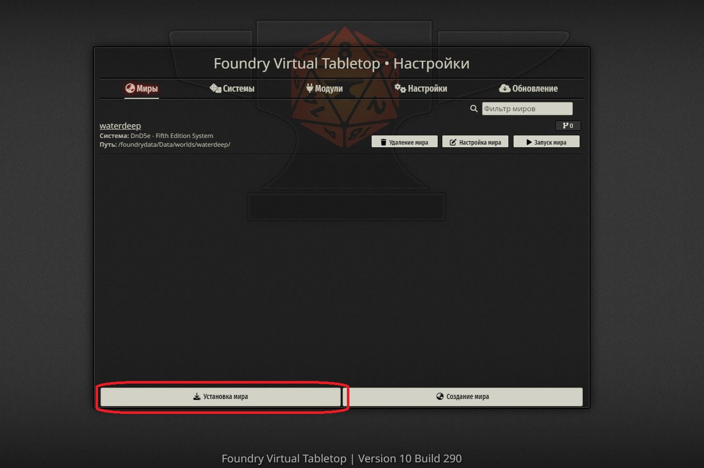
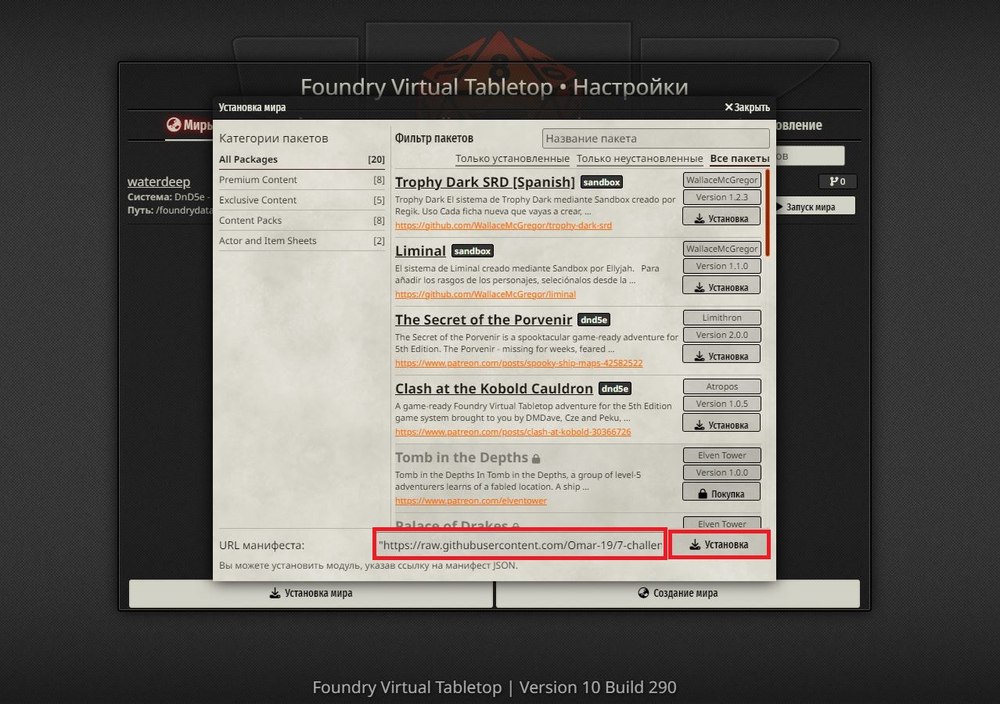

# 7 испытаний Гилберта

Героям в руки попадает зачарованная книга безумного волшебника Гилберта. 
По легенде, её страницы скрывают путь к месту, где спрятаны три кольца необычайной магической силы.
Смогут ли герои пройти все испытания и заполучить один из ценных артефактов?

## Контент

| Файл/Папка  | Описание |
| ------------- | ------------- |
| assets/scenes | превью сцен (внутренние файлы Foundry VTT, лучше не трогать)
| characters  | картинки для токенов неигровых персонажей  |
| data | вся необходимая информация о сценах, музыке, токенах и т.д. (внутренние файлы Foundry VTT, лучше не трогать)
| maps  | изображения с картами локаций из данного приключени |
| music  | все необходимые звуки от визга свиней до эпической музыки сражений |
| world.json | Файл со всей информацией о мире для системы Foundry, лучше не трогать, если только вы не знаете, что делаете. |

## Установка

1. Запускаем Foundry VTT и переходим на экран с выбором игрового мира. Нажимаем на кнопку "Установка мира".

2. Копируем ссылку на manifest.json данного приключения (мира) -- https://raw.githubusercontent.com/Omar-19/7-challenges-of-gilbert/main/world.json
   и вставляем в поле с подписью "URL манифеста". Нажимаем кнопку установить и ждем пока скачаются необходимые файлы.
   
   
   
   > После установки может появиться всплывающее окно с уведомлением о том, что необходимо установить модуль [laaru-dnd5-hw](https://boosty.to/laaru/posts/30ef2f20-5198-464d-9dc7-fd111b846295). Подробнее об этом в разделе ["Зависимости"](https://github.com/Omar-19/7-challenges-of-gilbert/tree/main#%D0%B7%D0%B0%D0%B2%D0%B8%D1%81%D0%B8%D0%BC%D0%BE%D1%81%D1%82%D0%B8)
   
3. Нажимаем кнопку "Запуск мира" и начинаем наше приключение! Пароль ГМ-а по умолчанию пустая строчка, вы можете его менять и добавлять других пользователей.

## Зависимости

- Для использования данного приключения желательно установить модуль [laaru-dnd5-hw](https://boosty.to/laaru/posts/30ef2f20-5198-464d-9dc7-fd111b846295). Сделать это необходимо вручную, т.к. ссылка для скачивания откроется только после оформления подписки на Boosty. Я очень рекомендую этот модуль, потому что он будет полезен не только для этого приключения, но и для любого другого, ведь он содержит все необходимые классы, заклинания, чудовищ и многое другое. Laaru (автор) регулярно обновляет и дополняет его.
  > Можно игнорировать ошибку при установке мира и играть без данного модуля, но тогда вам придется самим заполнять характеристики и имена NPC и игровых персонажей.

- Также необходимо установить систему [dnd5e](https://github.com/foundryvtt/dnd5e/) (делается через поиск в внутри самой Foundry VTT, на вкладке "Системы")
